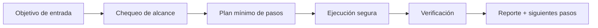

# 🔄 Phoenix Reborn

<p align="center">
  
</p>

<p align="center">
  <a href="./README.md"></a>
  <a href="./README.es.md"></a>
</p>

<p align="center"><em>🔄 Auto-resurrección y evolución post-fallo.</em></p>

---

## Resumen
Sistema de auto-recuperación que detecta fallos en la ejecución de skills, analiza causas raíz mediante meta-learning ligero y ejecuta retries con estrategia mejorada.

## Arquitectura de entendimiento


## Instalación
```bash
git clone https://github.com/smouj/Phoenix-Reborn.git
cd Phoenix-Reborn
cat SKILL.es.md
```

## Uso rápido
```bash
printf "ejecutando phoenix-reborn...\n"
```

## Estado
- Status: Iniciando
- Dificultad: Alta

## Roadmap
- [ ] Implementar lógica core v0
- [ ] Añadir tests de integración
- [ ] Publicar tag estable v1.0.0
