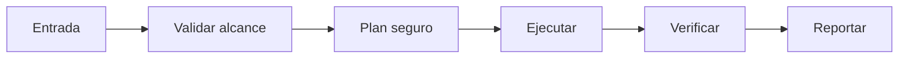

# 🔄 Phoenix Reborn

<p align="center">
  
</p>

<p align="center">
  <a href="./README.md"></a>
  <a href="./README.es.md"></a>
</p>

## Resumen
Auto-resurrección y evolución: si el agente falla/crash/olvida contexto crítico, revive de backups locales + analiza logs de fallos para mutar su propio prompt base y skills (meta-learning ligero). Evita loops de muerte repetida en tareas largas.

## Instalación
```bash
git clone https://github.com/smouj/Phoenix-Reborn.git
cd Phoenix-Reborn
cat SKILL.es.md
```

## Arquitectura de entendimiento


## Estado
Iniciando

## Dificultad
Alta
