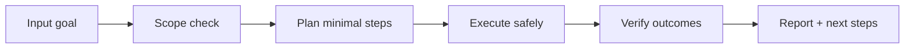

# 🔄 Phoenix Reborn

<p align="center">
  
</p>

<p align="center">
  <a href="./README.md"></a>
  <a href="./README.es.md"></a>
</p>

<p align="center"><em>🔄 Auto-resurrección y evolución post-fallo.</em></p>

---

## Overview
Sistema de auto-recuperación que detecta fallos en la ejecución de skills, analiza causas raíz mediante meta-learning ligero y ejecuta retries con estrategia mejorada.

## Architecture of understanding


## Installation
```bash
git clone https://github.com/smouj/Phoenix-Reborn.git
cd Phoenix-Reborn
# read the contract
cat SKILL.md
```

## Quick usage
```bash
# Example placeholder command
printf "running phoenix-reborn...\n"
```

## Badges
- Status: Initiating
- Difficulty: Alta

## Roadmap
- [ ] Implement core logic v0
- [ ] Add integration tests
- [ ] Publish stable tag v1.0.0
